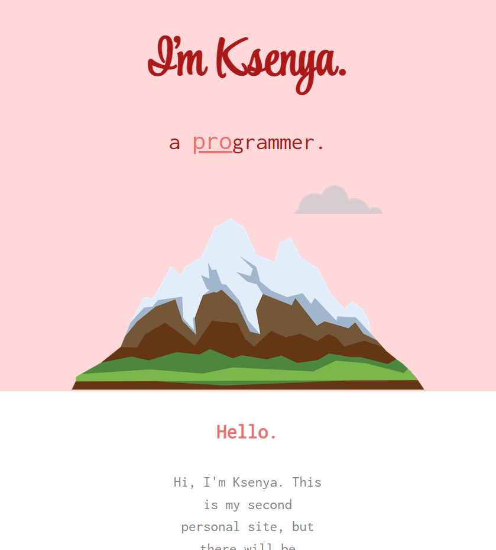
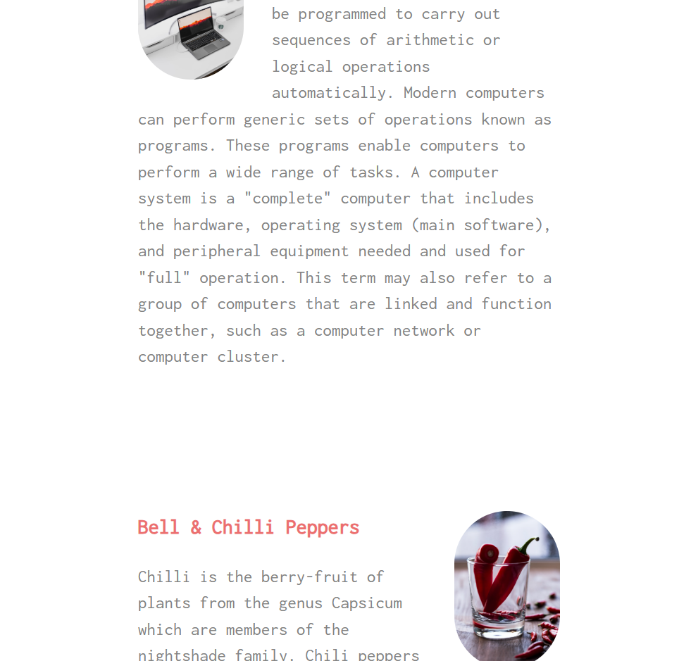

# Business card website

## 🎀 Personal business card website
A minimalistic and expressive business card website created as a starting platform for self-presentation. Perfect for beginner developers, designers, writers and creative individuals who want to make a name for themselves in the web space.

##💬 Content and structure
- A welcome block with the heading “Hello” — followed by a brief introduction
- The information is random — it easily adapts to a real biography, areas of activity, achievements or links

## Screenshots

